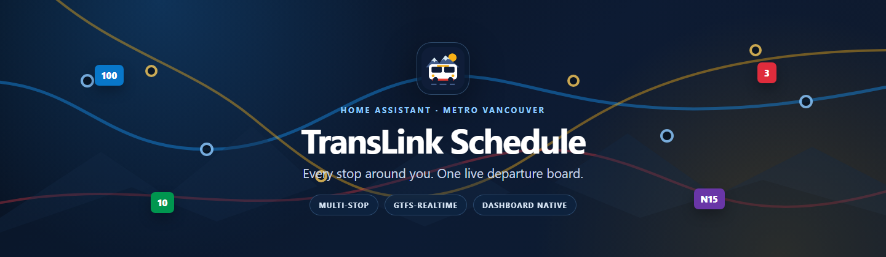
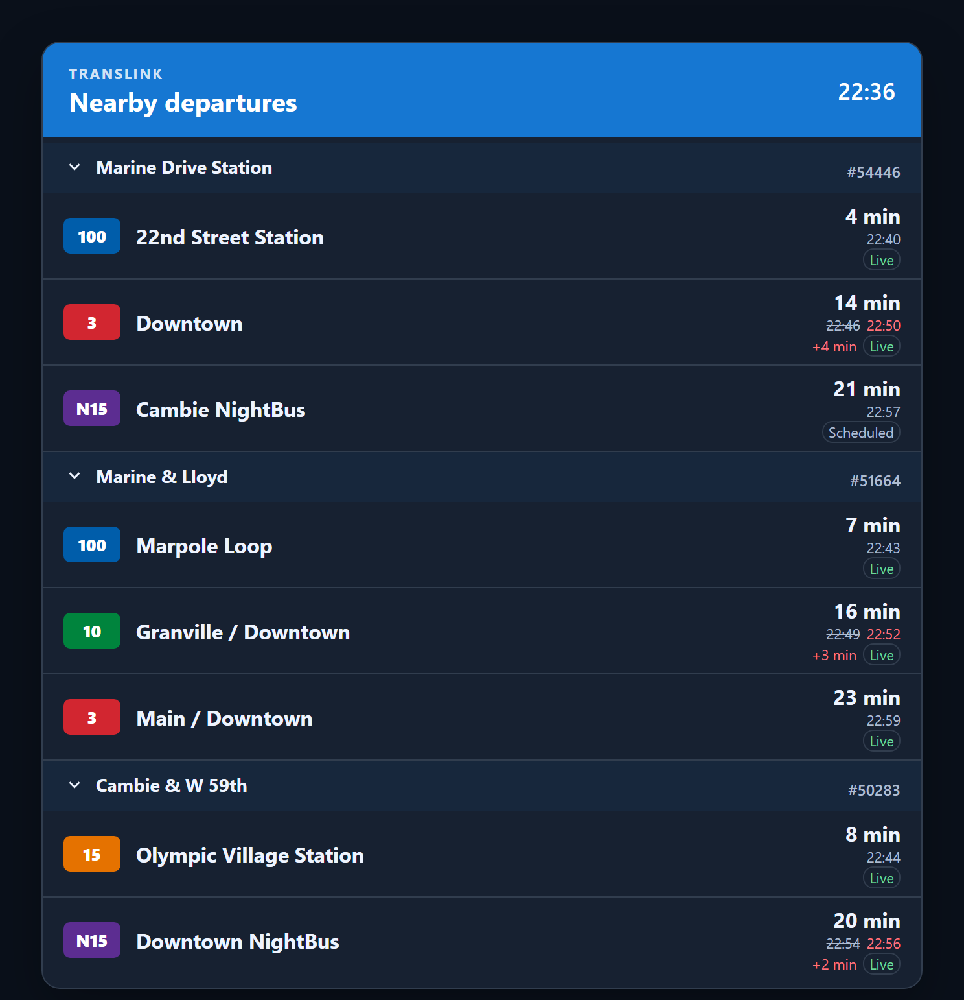
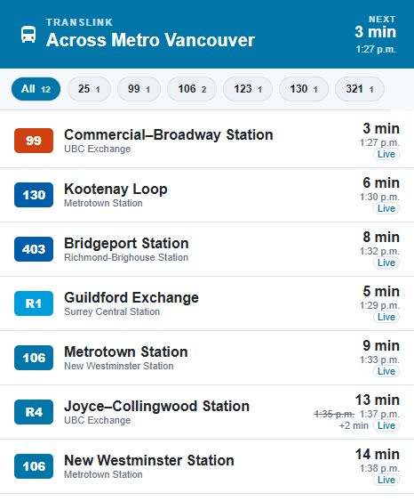
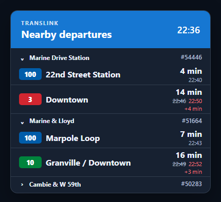

# TransLink Schedule



[](https://github.com/dballagi/ha-translink-card/actions/workflows/validate.yml)
[](https://github.com/dballagi/ha-translink-card/releases)
[](LICENSE)
[](https://hacs.xyz/docs/faq/custom_repositories/)

A Home Assistant custom integration and Lovelace card for upcoming departures
from every Metro Vancouver TransLink stop around you, together in one board.
Static GTFS schedules are merged with GTFS-Realtime predictions, delays,
cancellations, and service alerts while the API key remains in the backend.

## What it provides

- **Multi-stop departure boards** — group departures by stop or combine every
  configured stop into one list.
- **Realtime timing** — show countdowns, clock times, struck-through scheduled
  times, delays, cancellations, and Live/Scheduled labels.
- **Route-aware vehicle maps** — select a departure to see its planned GTFS
  route, boarding stop, destination, and last reported bus position.
- **Flexible ordering** — sort combined departures chronologically, balance
  stops, group routes, or place realtime predictions first.
- **Per-stop control** — filter routes and destinations, set custom names and
  row counts, show stop numbers, and choose collapsed defaults.
- **Dashboard-native presentation** — use Home Assistant theme colors,
  official route colors, three row densities, and responsive Sections sizing.
- **Visual configuration** — customize the card without writing YAML.
- **Shared local cache** — reuse one static feed, realtime feed, and polling
  coordinator across multiple boards.

## Screenshots

The examples below are rendered from the shipped card bundle with
representative sensor data.

### Grouped multi-stop board

Each stop keeps its own heading, departure limit, public stop number, and
collapsed state.



### Combined departures

Merge every configured stop into one chronological, balanced, route-grouped,
or realtime-first list.



### Responsive mobile layout

The same card adapts to narrow dashboards with compact headings and rows.

<p align="center">
  
</p>

## Status

This project is under active development and is not ready for general use yet.

## Installation and quick start

1. In HACS, add `https://github.com/dballagi/ha-translink-card` as a custom
   **Integration** repository.
2. Install **TransLink Schedule** and restart Home Assistant.
3. Add the integration from **Settings → Devices & services**.
4. Enter a TransLink developer API key and one or more comma-separated GTFS
   stop IDs or public five-digit stop numbers.
5. Open **Settings → Dashboards → ⋮ → Resources**, add
   `/translink_schedule/translink-schedule-card.js` as a **JavaScript module**,
   then refresh the browser.

API keys are available from the
[TransLink Developer Portal](https://developer.translink.ca/).

After upgrades, perform a hard refresh so the browser does not keep an older
card bundle.

## Integration configuration

Open the integration's **Configure** dialog to edit the board and configure
each selected stop. Every stop supports:

- **Included routes** — a multi-select containing only routes that serve that
  stop. Leave it empty to include every route.
- **Destination contains** — one or more case-insensitive phrases matched
  against the trip destination. Leave it empty to include every destination.
- **Custom stop name** — replaces the official stop name on the card.
- **Departures for this stop** — overrides the card-wide departure count. Use
  `0` to inherit the card setting.
- **Show stop number** — controls the public stop number for this stop.
- **Collapsed by default** — starts the stop section collapsed while still
  allowing users to expand it.

When both filters are set, a departure must match a selected route and one of
the destination phrases. Filters are applied before the grouped and combined
departure lists are exposed to the card.

The first Configure screen also controls:

- the order of stops, using the order of the entered stop IDs;
- the future schedule window, from 15 to 360 minutes; and
- how long cancelled departures remain available after their scheduled time.

## Card configuration

The integration bundles and serves the card. Registering the dashboard
resource is a one-time step because dashboard resources belong to the user's
Lovelace configuration.

Add the card from the dashboard card picker and use its visual editor, or
configure it directly in YAML:

In Sections dashboards, the card defaults to the full 12-column width and can
be resized down to 6 columns. **Auto height** expands with the schedule; when
you choose a fixed row height, the card fills that space and scrolls its
departure content.

```yaml
type: custom:translink-schedule-card
entity: sensor.nearby_departures
title: Nearby Departures
view: grouped
departures_per_stop: 3
max_departures: 12
time_display: both
show_scheduled_time: true
delay_threshold_minutes: 1
delay_format: compact
density: comfortable
empty_stop_behavior: show
cancelled_behavior: show
route_color_mode: official
show_route_filter: false
route_filter_reset_minutes: 5
route_filter_selection_mode: multiple
route_filter_show_counts: false
combined_order: chronological
show_header: true
show_brand: true
header_style: primary
header_icon: mdi:bus-clock
show_clock: true
show_alerts: true
show_stop_codes: true
stop_heading_style: accent
show_realtime_status: false
show_stale_warning: false
stale_after_minutes: 3
```

Set `show_alerts: false` or disable **Show service notices** in the visual
editor to hide the alert banner.

Use `departures_per_stop` or the **Departures per stop** visual-editor field
to show between 1 and 12 departures in each grouped stop section.

Timing can show `both`, `countdown`, or `clock`. The card follows Home
Assistant's 12/24-hour preference. `delay_format` accepts `compact` (`+7 min`)
or `text` (`7 min late`).

`cancelled_behavior` and `empty_stop_behavior` accept `show`, `move`, or
`hide`. The `move` value places those rows or sections after active content.

`density` accepts `comfortable`, `compact`, or `minimal`.
`route_color_mode` accepts `official`, `theme`, or `monochrome`.
`header_style` accepts `primary`, `surface`, or `transparent`, while
`stop_heading_style` accepts `accent`, `plain`, or `compact`.

Enable `show_route_filter` to add a horizontally scrollable **All** and route
chip row above the schedule. Route choices are sorted naturally and filter
both grouped and combined views before departure limits are applied.

`route_filter_selection_mode` accepts `multiple` or `single`.
`route_filter_show_counts` adds the number of available departures to each
chip. `route_filter_reset_minutes` resets the selection to **All** after the
latest filter interaction; set it to `0` to keep the selection until it is
changed manually. These settings are also available in the visual editor.

Every departure row is clickable and keyboard accessible. Selecting one opens
an on-demand map of that trip's planned GTFS shape. When TransLink reports a
matching vehicle, the map also shows its last reported position and mutes the
completed part of the planned route. If no vehicle is currently matched, the
planned route, boarding stop, and destination remain available. Vehicle
positions are snapshots and should not be interpreted as exact live locations.

Use `view: combined` and `max_departures` to display a single list.
`combined_order` accepts `chronological`, `balanced`, `route`, or `realtime`:

```yaml
type: custom:translink-schedule-card
entity: sensor.nearby_departures
title: Next Departures
view: combined
max_departures: 12
combined_order: balanced
```

Enable `show_realtime_status` to label departures as **Live** or
**Scheduled**. Enable `show_stale_warning` to show a warning when the
coordinator has not updated within `stale_after_minutes`.

## Development

Backend:

```powershell
python -m pip install -e ".[dev]"
ruff check .
pytest
```

Frontend:

```powershell
Set-Location frontend
npm install
npm run check
npm test
npm run build
```

## Releases

HACS uses published GitHub Releases for semantic versions. To prepare a
release:

1. Update the version in `pyproject.toml` and
   `custom_components/translink_schedule/manifest.json`.
2. From `frontend`, run
   `npm version <version> --no-git-tag-version` to update `package.json` and
   `package-lock.json`.
3. Run the backend and frontend validation commands above.
4. Commit and push the version bump and rebuilt card bundle.
5. In GitHub Actions, run the **Release** workflow and enter the exact version
   without a `v` prefix.

The workflow verifies that all version files match, reruns the test suites,
checks that the committed frontend bundle is current, and publishes a
`v<version>` GitHub Release. HACS will then display that release instead of a
commit hash.

## Data attribution

Route and arrival data used in this product or service is provided by
permission of TransLink. TransLink assumes no responsibility for the accuracy
or currency of the Data used in this product or service.

This project is not affiliated with or endorsed by TransLink.

Basemap tiles use Home Assistant's built-in
[Map tiles](https://www.home-assistant.io/integrations/map_tiles/) proxy and
cache, backed by [OpenStreetMap](https://www.openstreetmap.org/copyright).
Tiles are requested only when a departure map is opened.
