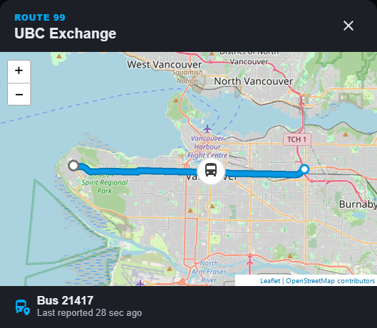
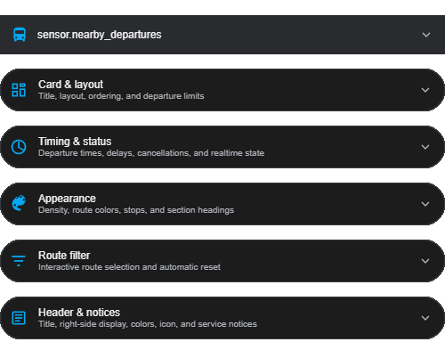

<div align="center">
  
  <br><br>
  <a href="https://www.home-assistant.io/"></a>&nbsp;
  <a href="https://my.home-assistant.io/redirect/hacs_repository/?owner=dballagi&repository=ha-translink-card&category=integration"></a>&nbsp;
  <a href="https://github.com/dballagi/ha-translink-card/releases"></a>&nbsp;
  <a href="https://github.com/dballagi/ha-translink-card/actions/workflows/validate.yml"></a>&nbsp;
  <a href="LICENSE"></a>
</div>

# TransLink Schedule

A Home Assistant custom integration and Lovelace card for upcoming departures
from every Metro Vancouver TransLink stop around you, together in one board.
Static GTFS schedules are merged with GTFS-Realtime predictions, delays,
cancellations, and service alerts while the API key remains in the backend.

> [!NOTE]
> This card is under active development and is primarily built for personal
> use around my own specific transit needs. Everyone is welcome to use it,
> adapt it to their dashboard, and share feedback.

## Why this card

Nearby transit rarely means a single stop. TransLink Schedule combines every
stop around you into one dashboard-native departure board while keeping API
keys, GTFS downloads, and realtime polling in the Home Assistant integration.

**Key features:**

- **Multi-stop departure boards** — group departures by stop or combine every
  configured stop into one list.
- **Realtime timing** — show countdowns, clock times, struck-through scheduled
  times, delays, cancellations, and Live/Scheduled labels.
- **Route-aware vehicle maps** — select a departure to see its planned GTFS
  route, boarding stop, destination, and last reported bus position.
- **Next-departure header** — replace the clock with the next matching bus in
  countdown, clock, or combined format.
- **Flexible ordering** — sort combined departures chronologically, balance
  stops, group routes, or place realtime predictions first.
- **Per-stop control** — filter routes and destinations, set custom names and
  row counts, show stop numbers, and choose collapsed defaults.
- **Dashboard-native presentation** — use Home Assistant theme colors,
  official route colors, three row densities, and responsive Sections sizing.
- **Visual configuration** — customize the card without writing YAML.
- **Shared local cache** — reuse one static feed, realtime feed, and polling
  coordinator across multiple boards.

## See it in action

The examples below are rendered from the shipped card bundle with
representative sensor data.

<table>
  <tr>
    <th>Grouped multi-stop board</th>
    <th>Combined departures</th>
  </tr>
  <tr>
    <td valign="top">
      <br>
      Per-stop headings, limits, stop numbers, and collapsed state.
    </td>
    <td valign="top">
      <br>
      Chronological, balanced, route-grouped, or realtime-first ordering.
    </td>
  </tr>
  <tr>
    <th>Route-aware live map</th>
    <th>Organized visual editor</th>
  </tr>
  <tr>
    <td valign="top">
      <br>
      Planned GTFS route, start, boarding stop, destination, and vehicle.
    </td>
    <td valign="top">
      <br>
      Settings grouped by layout, timing, appearance, filters, and header.
    </td>
  </tr>
</table>

<table width="358">
  <tr>
    <th>Responsive mobile layout</th>
  </tr>
  <tr>
    <td valign="top">
      <br>
      The same card adapts to narrow dashboards with compact headings and rows.
    </td>
  </tr>
</table>

## Installation

### HACS (recommended)

Open the repository directly in HACS:

[](https://my.home-assistant.io/redirect/hacs_repository/?owner=dballagi&repository=ha-translink-card&category=integration)

Or add it manually:

1. In HACS, add `https://github.com/dballagi/ha-translink-card` as a custom
   **Integration** repository.
2. Search for **TransLink Schedule**, download it, and restart Home Assistant.

### Quick start

1. Add the integration from **Settings → Devices & services**.
2. Enter a TransLink developer API key and one or more comma-separated GTFS
   stop IDs or public five-digit stop numbers.
3. Refresh the browser after setup. The integration automatically registers
   and versions its card resource on storage-managed dashboards.

API keys are available from the
[TransLink Developer Portal](https://developer.translink.ca/).

The resource URL is updated automatically after upgrades so browsers load the
matching card bundle. If Lovelace resources are managed in YAML, add
`/translink_schedule/translink-schedule-card.js?v=<installed-version>` as a
JavaScript module and update the version after upgrades.

## Integration configuration

Open the integration's **Configure** dialog to edit the board and configure
each selected stop. Every stop supports:

- **Included routes** — a multi-select containing only routes that serve that
  stop. Leave it empty to include every route.
- **Destination contains** — one or more case-insensitive phrases matched
  against the trip destination. Leave it empty to include every destination.
- **Custom stop name** — replaces the official stop name on the card.
- **Departures for this stop** — overrides the card-wide departure count. Use
  `0` to inherit the card setting.
- **Show stop number** — controls the public stop number for this stop.
- **Collapsed by default** — starts the stop section collapsed while still
  allowing users to expand it.

When both filters are set, a departure must match a selected route and one of
the destination phrases. Filters are applied before the grouped and combined
departure lists are exposed to the card.

The first Configure screen also controls:

- the order of stops, using the order of the entered stop IDs;
- the future schedule window, from 15 to 360 minutes; and
- how long cancelled departures remain available after their scheduled time.

## Card configuration

The integration bundles and serves the card. Registering the dashboard
resource is a one-time step because dashboard resources belong to the user's
Lovelace configuration.

Add the card from the dashboard card picker and use its visual editor, or
configure the same five groups directly in YAML:

In Sections dashboards, the card defaults to the full 12-column width and can
be resized down to 6 columns. **Auto height** expands with the schedule; when
you choose a fixed row height, the card fills that space and scrolls its
departure content.

```yaml
type: custom:translink-schedule-card
entity: sensor.nearby_departures

layout:
  title: Nearby Departures
  view: grouped
  combined_order: chronological
  departures_per_stop: 3
  max_departures: 12

timing:
  time_display: both
  show_scheduled_time: true
  delay_threshold_minutes: 1
  delay_format: compact
  cancelled_behavior: show
  show_realtime_status: false
  show_stale_warning: false
  stale_after_minutes: 3

appearance:
  density: comfortable
  route_color_mode: official
  empty_stop_behavior: show
  stop_heading_style: accent
  show_stop_codes: true

route_filter:
  show: false
  selection_mode: multiple
  show_counts: false
  reset_minutes: 5

header:
  show: true
  show_brand: true
  time_mode: clock
  next_departure_format: countdown
  style: primary
  icon: mdi:bus-clock
  show_alerts: true
```

### Top-level card settings

The card type and entity sit above the grouped visual-editor controls because
they identify the card and its data source.

| Name | Value | Default | Description |
| :--- | :--- | :--- | :--- |
| `type` | `string` | **Required** | Must be `custom:translink-schedule-card`. |
| `entity` | `string` | **Required** | TransLink Schedule sensor entity to display. |

### Card & layout

| Name | Value | Default | Description |
| :--- | :--- | :--- | :--- |
| `layout.title` | `string` | Board name | Heading shown in the card header. |
| `layout.view` | `grouped` or `combined` | `grouped` | Group departures under each stop or merge them into one list. |
| `layout.combined_order` | `chronological`, `balanced`, `route`, or `realtime` | `chronological` | Ordering used by the combined view. |
| `layout.departures_per_stop` | `number` from 1 to 12 | `3` | Maximum visible departures in each grouped stop. Per-stop integration settings can override it. |
| `layout.max_departures` | `number` from 1 to 50 | `12` | Maximum visible departures in the combined view. |

### Timing & status

| Name | Value | Default | Description |
| :--- | :--- | :--- | :--- |
| `timing.time_display` | `both`, `countdown`, or `clock` | `both` | Shows countdowns, clock times, or both. Clock values follow Home Assistant's 12/24-hour preference. |
| `timing.show_scheduled_time` | `boolean` | `true` | Shows the struck-through scheduled time when a departure is delayed. |
| `timing.delay_threshold_minutes` | `number` from 1 to 30 | `1` | Minimum delay before delayed styling and labels appear. |
| `timing.delay_format` | `compact` or `text` | `compact` | Uses `+7 min` or `7 min late`. |
| `timing.cancelled_behavior` | `show`, `move`, or `hide` | `show` | Keeps cancellations in schedule order, moves them below active trips, or hides them. |
| `timing.show_realtime_status` | `boolean` | `false` | Shows **Live** or **Scheduled** on departure rows. |
| `timing.show_stale_warning` | `boolean` | `false` | Warns when the coordinator has not updated recently. |
| `timing.stale_after_minutes` | `number` from 2 to 30 | `3` | Age at which realtime data is considered stale. |

### Appearance

| Name | Value | Default | Description |
| :--- | :--- | :--- | :--- |
| `appearance.density` | `comfortable`, `compact`, or `minimal` | `comfortable` | Controls departure-row and stop-heading spacing. |
| `appearance.route_color_mode` | `official`, `theme`, or `monochrome` | `official` | Uses TransLink route colors, the Home Assistant primary color, or neutral badges. |
| `appearance.empty_stop_behavior` | `show`, `move`, or `hide` | `show` | Keeps empty stops in configured order, moves them to the bottom, or hides them. |
| `appearance.stop_heading_style` | `accent`, `plain`, or `compact` | `accent` | Controls stop-heading background and spacing. |
| `appearance.show_stop_codes` | `boolean` | `true` | Shows public five-digit stop numbers when available. |

### Route filter

| Name | Value | Default | Description |
| :--- | :--- | :--- | :--- |
| `route_filter.show` | `boolean` | `false` | Adds a horizontally scrollable **All** and route-chip row. |
| `route_filter.selection_mode` | `multiple` or `single` | `multiple` | Allows several selected routes or one route at a time. |
| `route_filter.show_counts` | `boolean` | `false` | Shows the number of available departures in each route chip. |
| `route_filter.reset_minutes` | `number` from 0 to 60 | `5` | Resets the filter to **All** after inactivity. Set `0` to keep the selection. |

The active route filter is applied before grouped and combined row limits. It
also controls which departure appears in a next-departure header.

### Header & notices

| Name | Value | Default | Description |
| :--- | :--- | :--- | :--- |
| `header.show` | `boolean` | `true` | Shows or hides the entire card header. |
| `header.show_brand` | `boolean` | `true` | Shows the **TransLink** eyebrow above the title. |
| `header.time_mode` | `clock`, `next_departure`, or `hidden` | `clock` | Shows the current time, the next matching departure, or no right-side value. |
| `header.next_departure_format` | `countdown`, `clock`, or `both` | `countdown` | Controls next-departure timing when `header.time_mode` is `next_departure`. |
| `header.style` | `primary`, `surface`, or `transparent` | `primary` | Uses the theme primary color, card surface, or transparent header background. |
| `header.icon` | `string` | None | Optional Material Design icon such as `mdi:bus-clock`. |
| `header.show_alerts` | `boolean` | `true` | Shows service notices supplied by the integration. |

The next-departure header ignores cancelled trips and selects a trip before
visible row limits are applied. Existing flat configurations remain supported;
when grouped and flat forms are both present, grouped values take precedence.
Legacy `show_clock` and `hide_empty_stops` values continue to map to their
grouped equivalents.

### Route maps

Every departure row is clickable and keyboard accessible. Selecting one opens
an on-demand map of that trip's planned GTFS shape. When TransLink reports a
matching vehicle, the map also shows its last reported position. If no vehicle
is currently matched, the planned route, boarding stop, and destination remain
available. Vehicle positions are snapshots and should not be interpreted as
exact live locations.

### Combined layout example

```yaml
type: custom:translink-schedule-card
entity: sensor.nearby_departures
layout:
  title: Next Departures
  view: combined
  max_departures: 12
  combined_order: balanced
```

## Data attribution

Route and arrival data used in this product or service is provided by
permission of TransLink. TransLink assumes no responsibility for the accuracy
or currency of the Data used in this product or service.

This project is not affiliated with or endorsed by TransLink.

Basemap tiles use Home Assistant's built-in
[Map tiles](https://www.home-assistant.io/integrations/map_tiles/) proxy and
cache, backed by [OpenStreetMap](https://www.openstreetmap.org/copyright).
Tiles are requested only when a departure map is opened.
